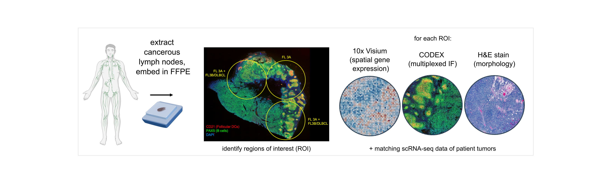
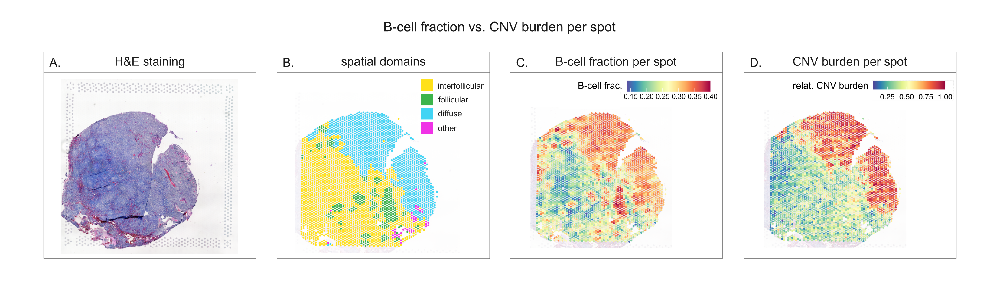
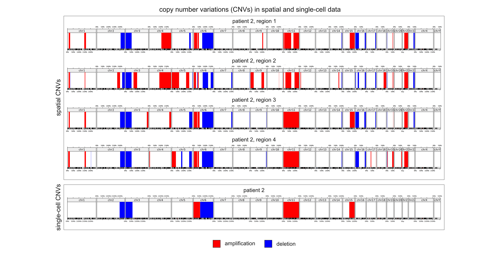
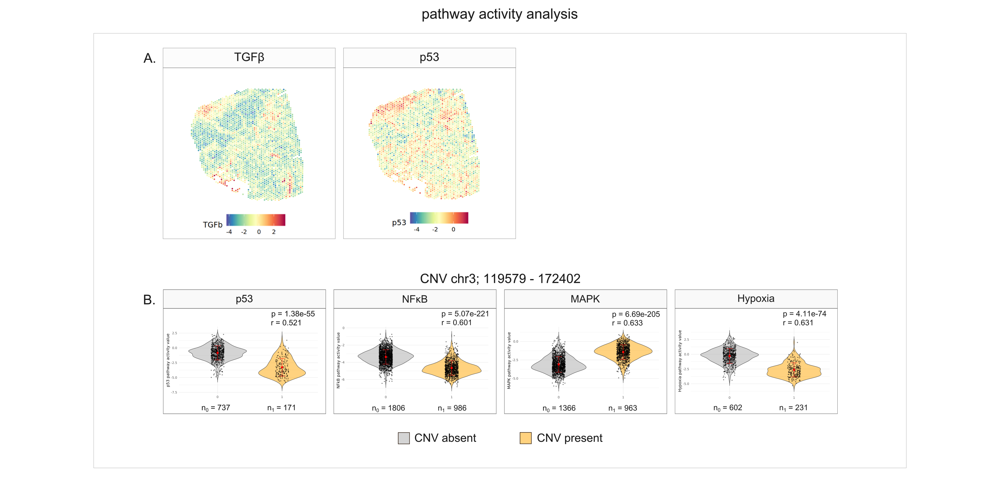
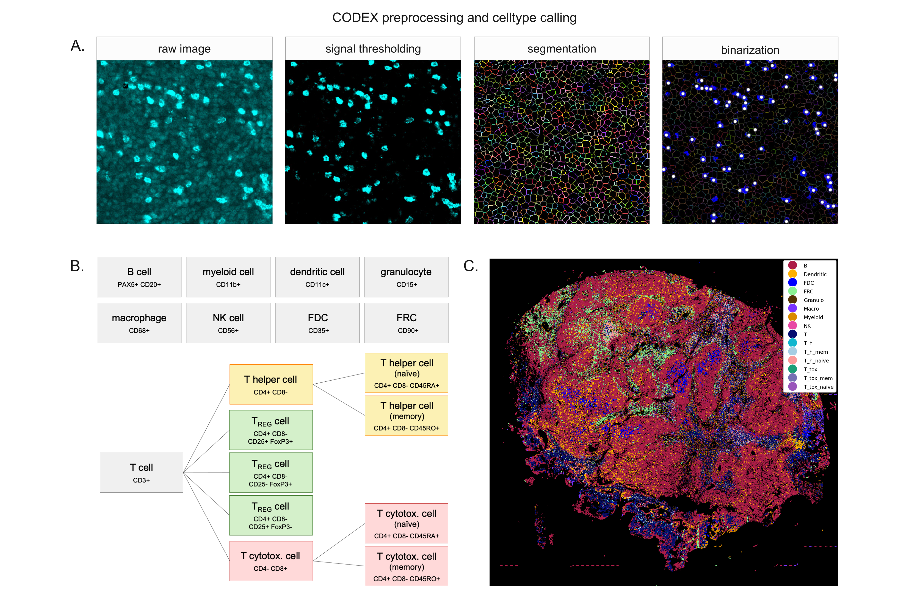
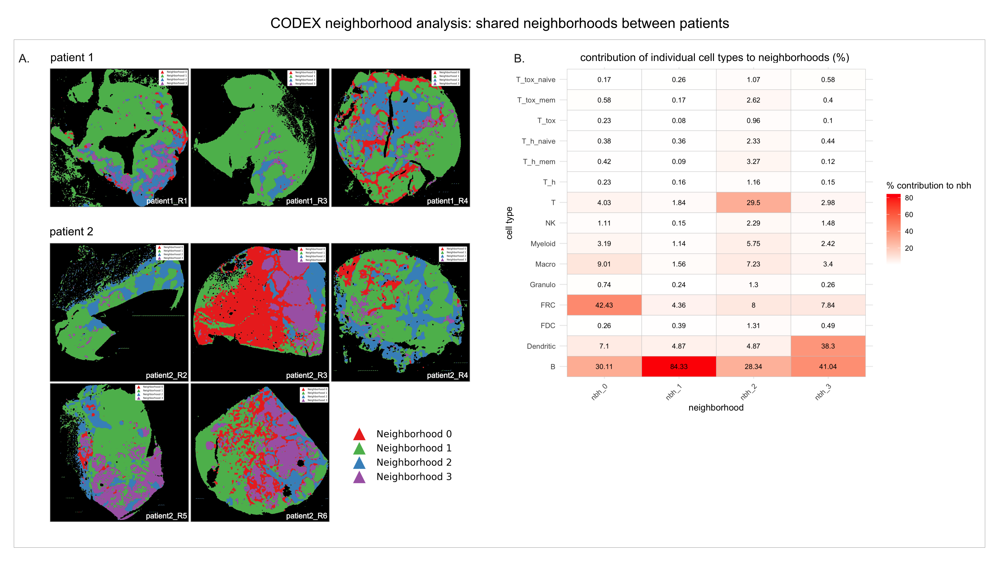

## Master's thesis project: Identification of tumor-enriched pathways and neighborhoods in transformed follicular lymphoma

This repository documents work from my masters thesis project conducted in the lab of Sinem Saka at EMBL Heidelberg (December 2024 - November 2025)

In the course of the thesis project, I analyzed a patient cohort of six patients diagnosed with follicular lymphoma transformation. For each of the patients, we had access to the following data modalities:
* spatial transcriptomics data (10x Visium)
* multiplexed immunofluorescence images (Akoya *PhenoCycler* Spatial Proteomics, i.e. "CODEX")
* joint single-cell RNA-seq and ATAC-seq data (10x multiome)

*Figure 1: Overview of cohort and data modalities. Cancerous lymph nodes of 6 patients diagnosed with follicular lymphoma transformation were resected and cut in half. One half of the lymph node was dissociated to harvest lymphocytes for 10x multiome sequencing. The other half of the tumor was embedded in FFPE, and adjacent 5 μm sections were used for 10x Visium spatial transcriptomics and CODEX.*

## Objectives
The main objectives of the project were to:

### 1. identify malignant regions in tissue samples
I inferred the presence of copy number variations (CNVs) from the 10x Visium data using *inferCNV* and compared them to CNVs identified in the 10x multiome data which had previously been inferred using *numbat*. Malignant tissue regions annotated by a pathologist based on morphology served as control, the CNV-based identification of malignant regions provided an independent molecular validation.

*Figure 2: H&E stains (panel A) as well as genomic information from the single-cell RNA sequencing data were used to identify malignant tissue regions (“spatial domains”) together with a pathologist, shown annotated in the 10x Visium data (panel B). CNVs inferred from the 10x Visium data using inferCNV (panel D) are spatially concentrated in regions of high B-cell density (panel C). Data shown: patient 1, region 4.*

*Figure 3: CNVs were inferred independenlty from the spatial data and compared to CNVs inferred from the patient-matching single-cell data. Despite higher noise in spatial data, the two modalities largely recover the same CNVs. Data shown: patient 2.*

### 2. investigate cancer-specific biological pathway activity
Using the prior knowledge network *PROGENy* and statistical models from the package *decoupleR*, I investigated pathway activity in tumor vs. non-tumor regions. I further was able to identify relationships between difference in pathway activity levels and the presence of copy number variations.

*Figure 4: Panel A: Pathway activity scores (PROGENy, decoupleR) for each Visium spot, shown for TGFb and p53. Positive scores indicates pathway upregulation, negative scores indicate pathway repression. Panel B: Pathway activity differs beetween spots with and without a representative CNV on chromosome 3, which links copy numer state to pathway activity levels. Data shown: patient 2, region 3.*

### 3. characterize cell types present in the cancer regions and tumor microenvironment
Using the CODEX spatial proteomics data, I identified cellular neighborhoods of different cell type compositions across patients. I also compared celltypes identified in the spatial proteomics data to the cell types present in the Visium data (which were inferred using the 10x multiome dataset and the package *cell2location*) in order to assess agreement of the two modalities.

*Figure 5: Panel A: CODEX preprocessing: per-marker thresholding to remove background signal, segmentation to define cell boundaries (Mesmer), and binarization to call marker-positive/negative cells. Panel B: cell types and their defining markers/marker combinations. NK cell: natural killer cell, FDC: follicular dendritic cell, FRC: fibroblastic reticular cell. Panel C: spatial distribution of identified cell types. Data shown: patient 2, region 4.*

*Figure 6: Panel A: Four coarse neighborhoods identifed using a radius approach to determine local neighborhoods (100-pixel radius) followed by k-means clustering (k = 4). Panel B: Cell type composition of each neighborhood. Data shown: patient 1, patient 2.*

